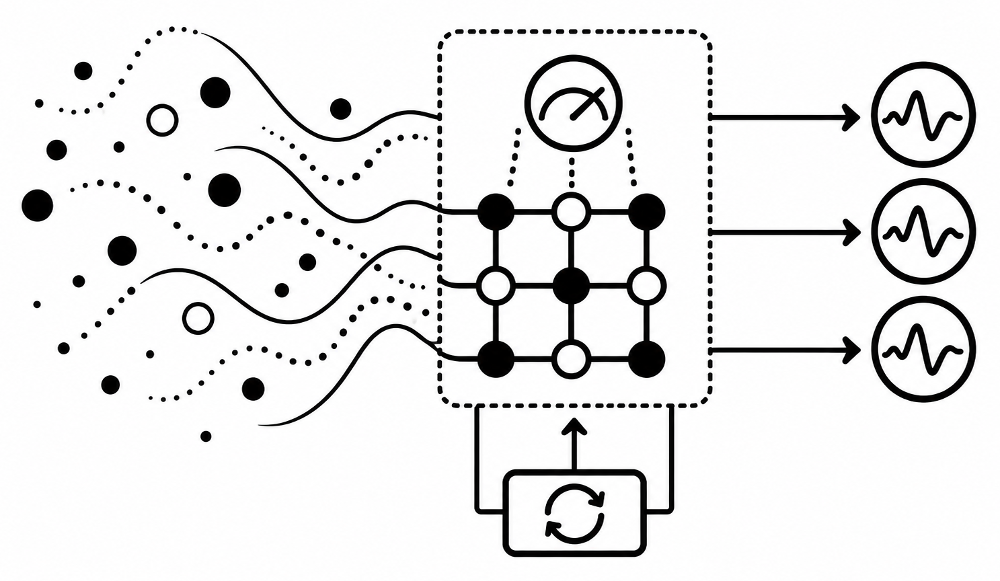

# Blind by Design QEC

<p align="left">
  
</p>

Computational supplement to:

**Peter Kahl, ‘Blind by Design: Quantum Error Correction, Functional Incompatibility and the Value of Evidence’ (2026). Lex et Ratio Working Paper LXR-2026-PHI-BBDQEC-WP, Version 1.0. DOI forthcoming.**

This repository contains the computational supplements to *Blind by Design: Quantum Error Correction, Functional Incompatibility and the Value of Evidence*. The four scripts examine different aspects of the paper's argument about what quantum error-correction measurements reveal, what they are designed not to reveal, and the distinction between blindness imposed by a measurement interface and blindness caused by an incomplete or misspecified downstream model.

The repository contains:

- a three-qubit repetition-code demonstration of syndrome-record invariance under opposite coherent rotations;
- an independent numerical check of the toric-code symmetry result used in the paper;
- construction and detector-error-model audit checks for the Stim/PyMatching simulations; and
- a continuous-error-correction simulation showing that model misspecification can be detectable and corrigible from records already available to the controller.

The scripts are computational illustrations and checks. They do not replace the analytical arguments in the paper.

## Conceptual distinction

A central distinction in the paper is between information that is absent from the accessible measurement record and information that is present in the record but not correctly extracted by the current model or decoder.

A downstream procedure may fail because its model is wrong, its estimator is inefficient, or it discards information already present in the record. Such failures can in principle be corrected without changing the physical measurement interface.

That is different from a distinction to which the measurement interface is invariant. If two conditions induce the same probability law over every accessible measurement history, no downstream reinterpretation of those histories can distinguish them. Additional access requires a measurement interaction that is sensitive to the distinction.

Quantum error correction makes this distinction particularly sharp because syndrome measurements are deliberately constructed to reveal error information while withholding encoded logical information.

## Scripts

### `blind_by_design_toy_repetition_code.py`

A minimal three-qubit repetition-code example.

The logical codewords are

```text
|0L> = |000>
|1L> = |111>
```

with stabilisers

```text
Z1 Z2
Z2 Z3
```

and coherent physical rotations

```text
Rx(theta) = exp(-i theta X / 2).
```

The script constructs the syndrome instrument explicitly from projectors, recovery operations and the logical encoding isometry.

It checks syndrome probabilities for several logical input states under `+theta` and `-theta`, examines the corresponding POVM effects, compares logical entanglement fidelity under different correction choices, and introduces a separate sentinel measurement that is sensitive to the sign of the rotation.

It also performs a stronger history-level numerical check using unequal rotation angles on the three physical qubits. All three angles are reversed simultaneously and every four-round syndrome history is enumerated for complex logical inputs.

The purpose is to distinguish two claims:

```text
the syndrome interface does not distinguish +theta from -theta
```

from

```text
+theta and -theta are physically indistinguishable.
```

The latter does not follow. The sentinel measurement provides a measurement interaction that is sensitive to the distinction.

Run with:

```bash
python blind_by_design_toy_repetition_code.py
```

The script requires NumPy.

### `ozguler_prop1_check.py`

An independent numerical check of the toric-code result used in the paper.

The script reconstructs the periodic toric-code instrument directly from the stated ingredients:

- edge indexing;
- `HX` and `HZ`;
- the logical frame;
- the code isometry;
- a reduced syndrome basis;
- minimum-weight recovery with a lexicographic tie rule; and
- uniform or edge-dependent coherent `X` rotations.

For the tractable lattice sizes `L = 2` and `L = 3`, it checks numerically:

```text
Fs(-theta) = Fs(theta)
```

for every syndrome effect, tests the real/parity form of the effects, verifies completeness, compares multi-round history probabilities at `+theta` and `-theta` for complex logical inputs, and checks

```text
Ks(-theta) = conjugate(Ks(theta).
```

For `L = 3`, it additionally assigns unequal rotation angles to the 18 edges and reverses all of them simultaneously.

The calculation is deliberately limited to small lattices because it uses explicit state vectors. At `L = 3` the code already acts on 18 physical qubits and therefore on `2^18` amplitudes. The script is a finite numerical check of the proposition, not a proof of the general result.

Run with:

```bash
python ozguler_prop1_check.py
```

The script requires NumPy.

### `audit_checks.py`

A construction-audit utility for the Stim/PyMatching simulations used during development of the paper.

It addresses three specific questions.

**Check 1: native versus B\*\*\*.**

The script compares the detector-error models produced by the native Stim depolarising-noise construction and the B\*\*\* construction in which depolarising channels are represented using Pauli-channel components.

It compares undecomposed detector signatures and, where requested, the resulting PyMatching edges. Running the comparison at both the original and half error rate helps distinguish first-order construction differences from discrepancies with quadratic scaling.

**Check 2: origin of the `D6` edge.**

The script examines detector-error-model terms involving detector `D6` and distinguishes a direct single-detector contribution from a graph-like component introduced by Stim's hyperedge decomposition.

Where Stim can provide the information, the script asks for the corresponding circuit fault locations.

**Check 3: detector geometry.**

The script retrieves detector coordinates, locates `D6` and its relevant partner, and examines whether detector-error-model terms connect `D6` directly to a boundary, including whether such terms also flip the logical observable.

The script can operate in several modes. To reconstruct the circuits used by the relevant experimental pipeline and run the full audit:

```bash
python audit_checks.py --pipeline
```

The default physical error rate is

```text
p = 0.005
```

with distance and rounds both defaulting to `5`.

Alternative values can be supplied, for example:

```bash
python audit_checks.py --pipeline --distance 5 --rounds 5 --p 0.005
```

The script can also inspect saved Stim circuits:

```bash
python audit_checks.py \
    --native native.stim \
    --bstar bstar.stim \
    --cb cb.stim \
    --native-half native_half.stim \
    --bstar-half bstar_half.stim
```

Running it without arguments invokes a self-contained Stim-generated demonstration rather than the paper's reconstructed pipeline.

This script requires Stim. PyMatching is additionally required for the matching-graph comparison used in pipeline mode.

### `blind_by_design_continuous_misspecification.py`

A continuous-error-correction simulation addressing a different form of blindness: failure caused by a misspecified downstream model rather than absence of information from the measurement record.

The system is the three-qubit bit-flip code. Physical qubits undergo bit flips at rate `gamma`, while the two stabilisers

```text
S1 = Z1 Z2
S2 = Z2 Z3
```

are monitored continuously.

The simulated measurement increments are

```text
dQk = 2 eta kappa sk dt + dWk,
```

where `eta` is detector efficiency, `kappa` is measurement strength, and `sk` is the current stabiliser sign.

The controller uses a Wonham filter over the four syndrome sectors but may assume an incorrect detector efficiency:

```text
eta_hat != eta_true.
```

The script asks two questions.

First, can the misspecification be detected from the records already available to the controller? It evaluates an innovation statistic based on the difference between observed and predicted measurement increments.

Second, can the model be repaired without changing the measurement interface? The script estimates `eta` by maximum likelihood from the same records and compares syndrome-tracking error under:

```text
the true eta
the incorrectly assumed eta
the re-estimated eta.
```

The default simulation uses:

```text
kappa = 4.0
gamma = 0.05
dt = 0.005

eta_true = 0.5
eta_assumed = 1.0

runs = 20
seed = 20261002
```

and evaluates records of duration

```text
T = 5
T = 25.
```

Candidate efficiencies are searched on the grid

```text
0.10, 0.15, ..., 1.50.
```

The example illustrates **model-relative blindness**. The controller performs poorly because its model of the measurement process is wrong, while evidence of that error remains present in the existing record. Correcting the model therefore does not require a new measurement coupling.

Run with:

```bash
python blind_by_design_continuous_misspecification.py
```

The script requires NumPy.

## What the computations establish

The four scripts serve different evidential roles and should not be treated as four instances of the same simulation.

`blind_by_design_toy_repetition_code.py` provides a deliberately small, explicit construction in which sign reversal can leave syndrome histories invariant while another measurement can remain sign-sensitive.

`ozguler_prop1_check.py` independently reconstructs and numerically checks the finite instances of the toric-code symmetry result used in the paper.

`audit_checks.py` audits the construction of the larger Stim/PyMatching computational experiments and the provenance of particular detector-error-model and matching-graph features.

`blind_by_design_continuous_misspecification.py` demonstrates the contrasting case in which apparent blindness results from model misspecification and can be diagnosed and reduced using records already available through the same measurement interface.

Together they support the paper's distinction between limitations of **inference from an existing record** and limitations imposed by **what the measurement interaction transmits into that record**.

## What the computations do not establish

The scripts do not prove the paper's general theoretical claims.

In particular:

- finite numerical agreement is not a proof of a symmetry for arbitrary code size;
- small state-vector calculations do not establish asymptotic behaviour;
- numerical equality is subject to floating-point precision;
- a decoder or controller's failure does not by itself establish interface-level blindness;
- successful detection of model misspecification does not imply that every form of blindness is recoverable from existing records;
- failure to distinguish two conditions using a stipulated syndrome interface does not establish that the conditions are physically indistinguishable under every possible measurement; and
- the audit utilities test specified circuit constructions and software representations, not quantum hardware.

The analytical and interpretive claims therefore depend on the definitions, assumptions and arguments given in the accompanying paper.

## Requirements

The scripts use Python 3 and the following packages:

```text
numpy
stim
pymatching
```

NumPy is used by the numerical simulation and checking scripts. Stim and PyMatching are required by `audit_checks.py`, with PyMatching specifically used for matching-graph construction and comparison.

A virtual environment is recommended:

```bash
python -m venv .venv
source .venv/bin/activate
pip install -r requirements.txt
```

No external empirical dataset is required. The simulations generate their data internally.

## Reproducibility

Where randomness is used, seeds are fixed explicitly in the source.

The continuous-misspecification simulation uses:

```text
seed = 20261002
```

The Özgüler numerical check uses fixed NumPy random-number-generator seeds for its random logical states and unequal-angle test.

The repetition-code history check is deterministic for the parameters specified in the source.

The scripts print the Python and relevant package versions where these are useful for interpreting numerical reproduction.

Exact textual identity of floating-point output across Python, NumPy, Stim, PyMatching, operating-system and hardware versions is not guaranteed. Small floating-point differences do not by themselves constitute a failure to reproduce the computational result.

## Repository structure

```text
blind-by-design-qec/
├── README.md
├── LICENSE
├── requirements.txt
├── blind_by_design_toy_repetition_code.py
├── ozguler_prop1_check.py
├── audit_checks.py
├── blind_by_design_continuous_misspecification.py
└── assets/
    └── blind-by-design-qec.png
```

## Citation

If you use the theoretical argument, please cite the accompanying paper:

> Kahl, P. (2026). *Blind by Design: Quantum Error Correction, Functional Incompatibility and the Value of Evidence*. Lex et Ratio Working Paper LXR-2026-PHI-BBDQEC-WP, Version 1.0. DOI forthcoming.

If a separately archived software release is assigned a persistent identifier, that software release should be cited separately when the code itself is reused or modified.

## Licence

The source code is released under the **MIT License**. See `LICENSE`.

The accompanying paper is a separate scholarly work.

## Disclaimer

This software is provided to support reproducibility, inspection and criticism of the computational arguments accompanying *Blind by Design*.

The scripts are research software. Their outputs should be interpreted together with the assumptions, definitions, analytical results and limitations stated in the paper. They are not independently sufficient to establish the paper's general claims about measurement, evidence or functional incompatibility.

The software is provided ‘as is’, without warranty of any kind, as specified in the MIT License.

## Author

**Peter Kahl**\
Independent Researcher, Lex et Ratio\
ORCID: [0009-0003-1616-4843](https://orcid.org/0009-0003-1616-4843)\
[www.lexetratio.com](https://www.lexetratio.com)