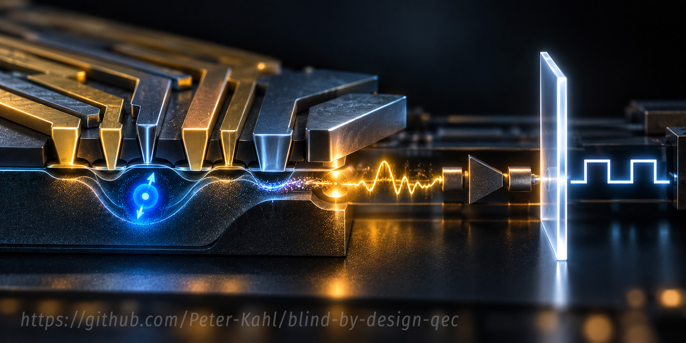

# Blind by Design: Computational Supplement

<p align="left">
  
</p>

Computational supplement to:

**Peter Kahl, ‘Blind by Design: Quantum Error Correction, Functional Incompatibility and the Value of Evidence’ (2026). Lex et Ratio Working Paper LXR-2026-PHI-BBDQEC-WP, Version 1.0. DOI to be assigned.**

The paper asks when evidence a system lacks marks a defect in how it inquires, and when it is required by what the system must do. Quantum error correction (QEC) is its test case: syndrome measurements are built to reveal errors while revealing nothing about the encoded information. The paper separates three kinds of blindness:

- **model-relative blindness**: evidence is present in the record but unused by the model through which the record is read;
- **observation-relative blindness**: a distinction the current procedures do not reveal, but some further procedure that preserves the system's function would; and
- **function-relative blindness**: a distinction no function-preserving procedure can reveal, as with an arbitrary unknown encoded quantum state.

Two propositions carry the function-relative case. Proposition 5.1 shows that an inquiry which performs its required operation exactly produces a classical record that is the same for every encoded state. Proposition 5.2 extends this to inquiries that perform the operation only approximately: if the inquiry falls short of its function by ε in diamond norm, after the best possible repair, its complete record distinguishes encoded states with total-variation distance at most 2√ε, and the shortfalls add over rounds.

This repository contains the five scripts behind the paper's computations, the complete output of each reference run, and the reliance note on the preprint result the paper uses.

## Contents and correspondence with the paper

| Script | Paper | What it shows |
|---|---|---|
| `prop52_numerical_check.py` | §5.3.1 | Numerical check of Proposition 5.2 (approximate classical-output blindness) on the toric and repetition codes |
| `blind_by_design_toy_repetition_code.py` | §§6.2–6.3 | Observation-relative and function-relative blindness in one minimal system |
| `ozguler_prop1_check.py` | §6.1; reliance note | Independent numerical check of the toric-code sign-symmetry result used in §6.1 |
| `audit_checks.py` | §6.4.1; Appendix A | Construction audit of the surface-code simulations |
| `blind_by_design_continuous_misspecification.py` | §6.4.2 | Model-relative blindness, detected and repaired from the records already held |

## The scripts

### `prop52_numerical_check.py`

A numerical check of the inequality in Proposition 5.2. Two measures are used. The *diamond norm* measures the distance between two quantum channels as the largest trace distance between their outputs over all inputs, including inputs entangled with an untouched reference system; it is unnormalised here, with range 0 to 2. The *leak* is the largest total-variation distance between the syndrome-history laws of any two encoded states, with range 0 to 1; it bounds the advantage of any test, however computed, that tries to tell from the record which state was stored.

On the L = 3 toric-code instrument of Özgüler (2026), rebuilt by `ozguler_prop1_check.py` (two logical qubits, uniform coherent X rotations by θ, ideal syndrome extraction, minimum-weight recovery), the script computes for seven angles from θ = 0.05 to 0.5:

1. the exact one-round leak;
2. the diamond distance of the one-round logical channel from the identity, ε_id, by semidefinite programme (SDP);
3. the same distance after a unitary decoder fitted to the logical channel, ε_dec, which bounds from above the 'best possible repair' in the proposition; and
4. the bounds 2√ε_id and 2√ε_dec, and their ratio to the leak.

It then repeats the instrument for N = 1, 2 and 3 rounds at θ = 0.1 and 0.3, compares the exact N-round leak with its bound, and checks that the N-round logical channel's distance from the identity is at most N times the one-round distance, as part (ii) of the proposition requires.

Two contrasts follow. In the three-qubit repetition code, every three-round history law is exactly independent of the encoded state, although the logical channel is not the identity: a blind record does not certify that the state is preserved, so the converse of the proposition fails. And a single sentinel qubit measured in the Y basis distinguishes the rotation's sign with per-shot total variation sin θ, whereas the passive syndrome record's sign discrimination is identically zero (checked by `ozguler_prop1_check.py`).

In the reference run the bound holds at every angle and round count. It is loose by a factor of about 20,000 at θ = 0.05 and about 7 at θ = 0.5. At small angles the leak grows as θ⁶ (that is, θ^2L), ε_id as θ³ (the coherent logical rotation) and ε_dec as θ⁴ (what remains once the fitted decoder removes that rotation).

Two safeguards make the verdicts independent of solver tolerance. Every reported diamond distance is a certified upper bound, because the SDP's dual solution is shifted until it is exactly feasible before the objective is evaluated. Every check of the inequality is made at a certified lower bound, the trace distance produced by a maximally entangled input. The SDP is validated against the closed form 2 sin(φ/2) for a single-qubit phase rotation. The leak is computed exactly from the parity form of the history effects, F_h = q_h I + g_h P with P the product of the two logical X operators; the script reports the largest deviation from that form, which is at rounding level throughout.

### `blind_by_design_toy_repetition_code.py`

The three-qubit repetition code (|0_L⟩ = |000⟩, |1_L⟩ = |111⟩; stabilisers Z₁Z₂ and Z₂Z₃) under coherent rotations R_x(θ) = exp(−iθX/2), with majority-vote recovery. The script builds the syndrome instrument explicitly and checks that:

1. the syndrome probabilities are the same for every logical input (blindness to the stored state) and at +θ and −θ (blindness to the rotation's sign);
2. every syndrome effect is a multiple of the identity on the code space, and the effects sum to the identity;
3. the sign matters: a correction tuned to +θ restores the memory at +θ (entanglement fidelity 1.000 after 50 rounds) and damages it at −θ (0.913), against 0.976 with no extra correction;
4. a sentinel qubit measured in the Y basis reveals the sign (⟨Y⟩ = ∓0.199) without touching the memory; and
5. every four-round syndrome history has the same probability at +θ and −θ, for complex inputs and unequal angles on the three qubits reversed together.

Blindness to the sign is observation-relative: the sentinel is a function-preserving procedure that recovers it. Blindness to the stored state is function-relative: no procedure that reveals it leaves the stored state intact. The agreement in check 5 is a check on the implementation; the equality itself follows from a real-structure symmetry of the instrument (§6.2).

### `ozguler_prop1_check.py`

An independent reconstruction of the periodic toric-code instrument of Özgüler (2026, Proposition 1), built from the preprint's definitions without using its code: edge indexing, plaquette and star check matrices, logical frame and code states, reduced syndrome, minimum-weight X recovery with a lexicographic tie rule, and coherent X rotations on every edge. For L = 2 and L = 3 it checks sign symmetry of every syndrome effect, the real parity form of the effects, completeness, equality of multi-round history probabilities for random complex inputs, and, at L = 3, sign symmetry under unequal per-edge angles reversed together. Sanity checks confirm the code states and logical operators.

The proposition is stated for odd L ≥ 3. L = 2 is included as a contrast outside its scope: there the parity form fails, as expected, although sign symmetry holds. State-vector simulation scales as 2^(2L²), so L = 3 (18 qubits, 2¹⁸ amplitudes) is the largest tractable case. These are finite checks; the general result rests on the proof, re-derived in `docs/reliance_note_ozguler2026.md`. The instrument this script builds is also the one `prop52_numerical_check.py` uses.

### `audit_checks.py`

A construction audit of the Stim and PyMatching simulations of §6.4.1: a rotated surface-code memory, distance 5, five rounds, with two-qubit depolarising noise at p = 0.005. It reports validation, not findings. In pipeline mode it rebuilds the paper's circuits and runs:

1. **Native versus baseline.** The baseline re-expresses each depolarising channel as a PAULI_CHANNEL with individually adjustable components (labelled `B***` in the code). Its matching-graph probabilities differ from the native circuit's on all 502 edges, by at most 6.96 × 10⁻⁵, because Stim converts PAULI_CHANNEL noise only approximately. The script confirms this from Stim's refusal of exact conversion, the sign of the gap, and its scaling when the error rate is halved (0.259, against 0.25 expected for a second-order effect).
2. **The origin of a lone-D6 edge.** The paper's correlated error (a Y error on qubits 6, 7, 19 and 20 together, labelled `A5`) produces a genuine single fault whose signature is detector D6 alone. An earlier comparison family (labelled `C_B`) produces a lone-D6 edge only through Stim's hyperedge decomposition; the paper does not use it as evidence.
3. **The geometry of D6.** D6 is a first-round detector on the outermost row, with matching edges to D3, D9 and D13 only and no edge to the boundary; its only route to the boundary runs through D9.
4. **Implementation checks of the lemma in Appendix A.3** (optional, `--lemma-checks`). Deleting each of the 520 noise-channel occurrences in turn, and reweighting every channel at random within the same support (131 reweightings, fixed seed), never creates the boundary edge e* and never adds an edge.

Check 4 re-implements, in a single script, the deletion and reweighting audits run during development and reported in Appendix A.

### `blind_by_design_continuous_misspecification.py`

Continuous error correction on the three-qubit bit-flip code: each qubit flips at rate γ, and the stabilisers are measured continuously with record increments dQ_k = 2ηκ s_k dt + dW_k. A Wonham filter tracks the syndrome while assuming a detector efficiency of 1 when the true value is 0.5. The script shows that:

- the misspecification degrades syndrome tracking (3.1 against 6.7 per cent error at T = 25);
- an innovation statistic computed from the controller's own records flags it in every run; and
- re-estimating the efficiency by maximum likelihood from the same records, and rerunning the filter retrospectively, restores the tracking error to 3.1 per cent.

No new measurement is needed: the blindness is model-relative. With no feedback the problem is classical (a hidden Markov chain with a misspecified observation strength), and the methods are standard filtering techniques; the case is included to show the remedy at work. The null distribution of the innovation statistic is checked empirically, not derived.

## What the computations do not establish

- Finite numerical agreement does not prove a symmetry for arbitrary code size; the toric-code result rests on its proof.
- Proposition 5.2 rests on its proof, not on `prop52_numerical_check.py`. The script checks the inequality on two instruments, at seven angles and up to three rounds; it does not test adaptive inquiries, other codes or other noise.
- The fitted decoder in `prop52_numerical_check.py` is one unitary repair, not the best possible repair over all channels. The bound it yields is therefore valid but may be weaker than the proposition allows.
- How loose the bound is on these instruments says nothing about how loose it is in general.
- Small state-vector calculations say nothing about asymptotic behaviour.
- Numerical equality holds only to floating-point precision.
- A decoder's or controller's failure does not by itself show that information is absent from the record.
- Detecting one misspecification from existing records does not show that every blindness is recoverable that way.
- Failure to distinguish two conditions through a given syndrome interface does not show that they are physically indistinguishable under every measurement.
- The audit tests specified circuit constructions and their software representations, not quantum hardware. Its lemma checks support, but do not prove, the statement that Stim's decomposition depends only on which mechanisms are present.
- The surface-code decoding results of §6.4.1 (the logical-error penalty and the detectability of the correlated error) were produced by the author's development scripts; this repository contains the construction audit of those simulations, not the decoding runs themselves.

The analytical and interpretive claims depend on the definitions, assumptions and arguments of the paper.

## Requirements

- Python 3.9 or later for `prop52_numerical_check.py`; Python 3.8 or later for the other NumPy scripts; for `audit_checks.py`, a Python version supported by current Stim releases
- NumPy 1.20 or later for `prop52_numerical_check.py`; NumPy 1.17 or later for the other NumPy scripts
- CVXPY 1.4 or later, with the Clarabel solver installed by default (`prop52_numerical_check.py` only)
- Stim and PyMatching (`audit_checks.py` only)

```bash
python -m venv .venv
source .venv/bin/activate
pip install -r requirements.txt
```

No external data are needed: every script generates its own data.

## Running

```bash
python prop52_numerical_check.py
python blind_by_design_toy_repetition_code.py
python ozguler_prop1_check.py
python audit_checks.py --pipeline --lemma-checks
python blind_by_design_continuous_misspecification.py
python blind_by_design_continuous_misspecification.py --kappa 1
```

`prop52_numerical_check.py` imports `ozguler_prop1_check.py`, so run it from the repository folder. The last command reproduces the parameter-sensitivity figures quoted in §6.4.2. Run times on a laptop are seconds for the repetition-code and continuous scripts, under a minute for the toric-code check and for the audit without `--lemma-checks`, and about one to two minutes each for `prop52_numerical_check.py` and for the audit with `--lemma-checks`. `audit_checks.py` also has a `--mirror` mode, a mode for saved `.stim` circuits, and a self-contained demonstration when run without arguments; the demonstration uses a different circuit and does not reproduce the paper's figures. Use `--help` on either of the two scripts with options.

## Reference output

The `output/` folder holds the complete, unedited console output of each reference run, produced by version **0.2.0** of the scripts with Python 3.12.3, NumPy 2.4.4, Stim 1.16.0, PyMatching 2.4.0, CVXPY 1.9.3 and Clarabel 0.11.1:

| File | Command |
|---|---|
| `prop52_numerical_check_output.txt` | `python prop52_numerical_check.py` |
| `toy_repetition_code_output.txt` | `python blind_by_design_toy_repetition_code.py` |
| `ozguler_prop1_check_output.txt` | `python ozguler_prop1_check.py` |
| `audit_checks_pipeline_output.txt` | `python audit_checks.py --pipeline --lemma-checks` |
| `continuous_misspecification_output.txt` | `python blind_by_design_continuous_misspecification.py` |
| `continuous_misspecification_kappa1_output.txt` | `python blind_by_design_continuous_misspecification.py --kappa 1` |

The five outputs carried over from version 0.1.0 were regenerated in the same environment and are identical to the 0.1.0 reference files except for the version line. The elapsed-time line printed by the continuous script is omitted from its reference files, since it varies between runs. To compare a new run with a reference file:

```bash
python ozguler_prop1_check.py > my_run.txt
diff -u output/ozguler_prop1_check_output.txt my_run.txt
```

Exact textual identity is not guaranteed across Python, NumPy, Stim, PyMatching, CVXPY, solver or platform versions. Differences in the last digits of quantities at the level of floating-point rounding (around 10⁻¹⁶ or smaller) do not indicate a failure to reproduce. Diamond distances in `prop52_numerical_check.py` are computed by an iterative solver, and may differ in the third or fourth significant figure across solver versions; the solver reports some solves as 'optimal_inaccurate' (11 in the reference run). Its pass/fail verdicts do not depend on either, because of the certified bounds described above.

## Reproducibility

All randomness uses fixed seeds set in the source: 20261002 for the continuous simulation, 1 and 7 for the random inputs and unequal angles of the toric-code check, and 20260925 for the audit's random reweightings. The repetition-code script and `prop52_numerical_check.py` are deterministic. Each script prints its version and the package versions it ran with.

## Repository structure

```text
blind-by-design-qec/
├── README.md
├── CHANGELOG.md
├── LICENSE
├── CITATION.cff
├── .zenodo.json
├── .gitignore
├── requirements.txt
├── prop52_numerical_check.py
├── blind_by_design_toy_repetition_code.py
├── ozguler_prop1_check.py
├── audit_checks.py
├── blind_by_design_continuous_misspecification.py
├── docs/
│   └── reliance_note_ozguler2026.md
├── output/
│   ├── prop52_numerical_check_output.txt
│   ├── toy_repetition_code_output.txt
│   ├── ozguler_prop1_check_output.txt
│   ├── audit_checks_pipeline_output.txt
│   ├── continuous_misspecification_output.txt
│   └── continuous_misspecification_kappa1_output.txt
└── assets/
    └── blind-by-design-qec-2.jpg
```

## Version correspondence

The figures reported in Version 1.0 of the paper, including the numerical check of Proposition 5.2 in §5.3.1, correspond to version **0.2.0** of this software. Version 0.1.0 accompanied an earlier draft without Proposition 5.2; its other results are unchanged in 0.2.0. Use the archived release of the matching version when reproducing or citing figures. See `CHANGELOG.md` for the history of changes.

## Citation

If you use the theoretical argument, please cite the paper:

> Kahl, P. (2026) *Blind by Design: Quantum Error Correction, Functional Incompatibility and the Value of Evidence*. Lex et Ratio Working Paper LXR-2026-PHI-BBDQEC-WP, Version 1.0.

If you use or modify the software, please also cite the archived software release. Citation metadata are in `CITATION.cff`. The paper and the software are separate scholarly objects with separate persistent identifiers.

The toric-code result checked by `ozguler_prop1_check.py`, and the instrument used by `prop52_numerical_check.py`, are due to:

> Özgüler, A.B. (2026) ‘Securing quantum error correction against misleading advice from AI agents’. arXiv:2609.19090 [quant-ph]. Preprint.

The proof of Proposition 5.2 rests on, and the diamond-norm computation in `prop52_numerical_check.py` uses, respectively:

> Kretschmann, D., Schlingemann, D. and Werner, R.F. (2008) ‘The information-disturbance tradeoff and the continuity of Stinespring’s representation’, *IEEE Transactions on Information Theory*, 54(4), pp. 1708–1717. doi:10.1109/TIT.2008.917696.

> Watrous, J. (2013) ‘Simpler semidefinite programs for completely bounded norms’, *Chicago Journal of Theoretical Computer Science*, 2013, Article 8. doi:10.4086/cjtcs.2013.008.

## Licence

The source code is released under the **MIT License** (see `LICENSE`). The accompanying paper and the reliance note are separate works, licensed under **CC BY 4.0**.

## Disclaimer

This software supports reproducibility and scrutiny of the computations accompanying *Blind by Design*. Its output should be read together with the assumptions, definitions, analytical results and limitations stated in the paper. It is not, by itself, sufficient to establish the paper's general claims about measurement, evidence or functional incompatibility.

The software is provided ‘as is’, without warranty of any kind, as specified in the MIT License.

## Author

**Peter Kahl**\
Independent researcher, Lex et Ratio\
ORCID: [0009-0003-1616-4843](https://orcid.org/0009-0003-1616-4843)\
[www.lexetratio.com](https://www.lexetratio.com)
